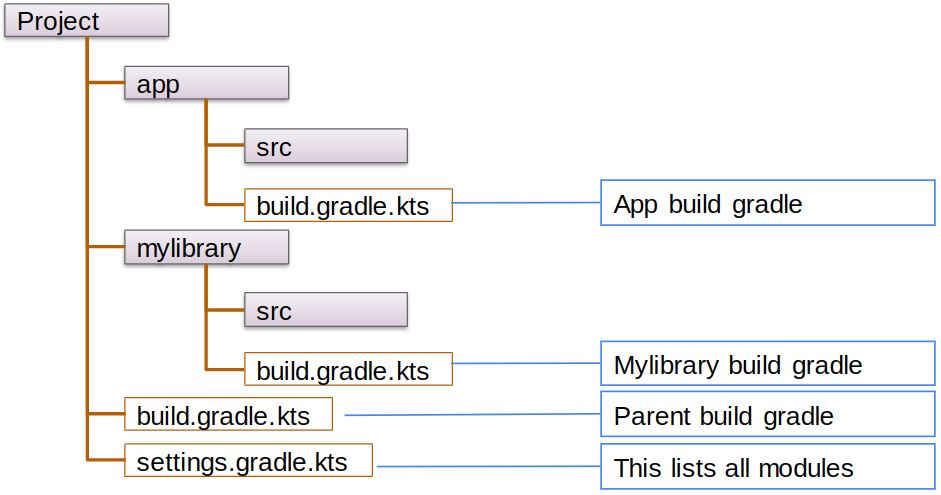
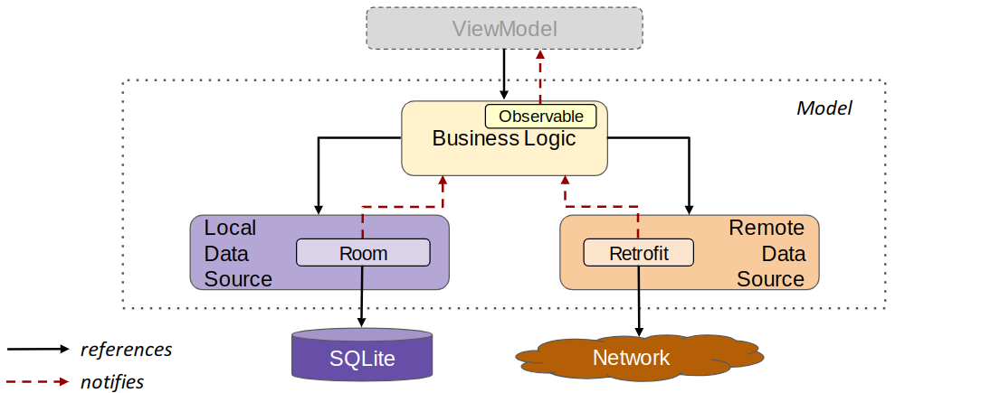
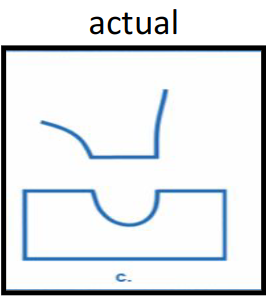

# Summary

- [Introduction to Mobile Application Development](#introduction)
- [Gradle](#gradle)
- [Android](#android)
    - [Android platform and architecture](#android-platform-and-architecture)
    - [Security](#security)
    - [Application Structure](#application-structure)
    - [Android Components](#android-components)
    - [Application Lifecycle](#application-lifecycle)
    - [Android Processes](#android-processes)
    - [Intents](#intent)
    - [Android Threading](#android-threading)
    - [Android Data Layer - Model](#android-data-layer---model)
    - [Dependency Injection](#dependency-injection)
    - [Navigation](#navigation)
    - [User Interactions](#user-interactions)
- [Architectural Patterns](#architectural-patterns)
- [Animations](#animations)
- [Cross Platform Mobile Applications](#cross-platform-mobile-applications)
- [Mobile UX Design](#mobile-ux-design)
- [Information Architecture](#information-architecture)

---

# Introduction

The design of a service in one of the pillars that can make successful a product or not. From a technical point of view the product is made by hardware resources and the software running on them; but in the user's mind, the product is a collection of experiences: the **UX: User experience**.

A **bad UX generally leads the user to abandon the app**: if the product does not work as expected, although the task is successfully completed, the user will be frustrated and the it will be less likely to use the app again.

> ***Some stats***: 
> - 25% of apps are opened once and never again
> - 48% of apps are opened 10 times or less

## Goals and Challenges

The **challenges** of designing a mobile application are:

- The various **possible contexts** where the application can be user: mobility, attention level required to achieve the task, the environmental condition in which the user is (maybe stressful, noisy, etc.).

- The various kinds of typical **user interaction**: touch and gestures, thumb rule and patterns.

- The requirements in terms of **ease of use** and the need to be able to use the app **on a mobile device** (limited display size and resolution, network speed and battery consumption).

In addition to these challenges, the heterogeneous nature of the mobile ecosystem, with different families of operative systems and devices mixed to the heterogeneity of the users that will use the app, makes the design of a mobile application a complex task with many variables to consider.

The **main goal** of a designer is to create an application that satisfy all of these challenges providing a **good user experience**.

## Skills

The required skills for a full stack development of a mobile application is quite transversal and wide: it is a mix of technical skills coming from the **computer engineering** and from the field of **human sciences** (psychology, sociology, etc.) passing through the **design**, the **marketing** and **project management**.

<div style="text-align: right; font-size: 0.8em;">

[Back to top](#summary)

</div>

---

# Gradle

Gradle is a build automation tool that is used to automate the process of building, testing, deploying and packaging software. It is based on the concept of **project** and **task**.

It supports:

- **JVM-based languages** (Java, Groovy, Kotlin)
- **Android** (Java, Kotlin)
- **Native Languages** (C/C++, Swift, Objective-C)
- **Other languages** (Go, Python, etc.)

The build process is described in one or more script files where all the information are defined in a **declarative way** via a DSL (Domain Specific Language). It supports two different syntaxes: **Groovy** (`build.gradle`) and **Kotlin** (`build.gradle.kts`).

The general principles that guide Gradle are:

1. **Convention over configuration**: Gradle uses a set of conventions to define the build process, but it allows to override them if needed.

2. **Extensibility**: Gradle is highly extensible and allows to define custom tasks and plugins.

3. **Dependency management**: Gradle allows to define dependencies and collecting them by downloading them automatically from listed repositories.

4. **Incremental build**: Gradle is able to build only the parts of the project that have changed since the last build.

5. **Multi-module projects**: Gradle supports multi-module projects and allows to define dependencies between modules.

## Standard Project Structure

A standard project structure in Gradle is composed by:


When multiple modules are used, the project structure is more complex and includes an additional level of folders (one for each module) with their own `build.gradle` file.



The project `build.gradle` file in the root folder is used to define common configurations and all the modules that are part of the project.

The module `build.gradle` files are used to define the specific configurations for each module.

## Modules

A module is a self-contained unit of the project that can be built, tested and deployed independently from the other modules. 

Each module has its own codebase, dependencies and resources. These information are specified in the `build.gradle` file of the module.

## Gradle files

### project : `build.gradle`

The project `build.gradle` file contains the overall description of the build process of the project in terms of:

- **Plugins**, the plugins define the tasks that are available in the project. [More details here](#plugins)
- **Repositories**, the repositories where the dependencies can be downloaded. [More details here](#repositories)
- **Dependencies**, the dependencies of the project: this is a list of all the external libraries used by the project. [More details here](#dependencies)
- **Other information**, like the project name, the version, etc.

### module : `build.gradle`

The module `build.gradle` file contains the specific configuration of the module in terms of:

- **Plugins**, the plugins define the tasks that are available in the module. [More details here](#plugins)

- **Dependencies**, the dependencies of the module: this is a list of all the external libraries used by the module. [More details here](#dependencies)

- **Android settings**, the settings specific to the Android platform like the namespace, default configuration (minimum SDK version, target SDK version, etc.), build types (ProGuard, debug signing, compile and kotlin options, ...).

### `settings.gradle`

The `settings.gradle` file is used to define the modules that are part of the project and the overall project configuration.

## Gradle Tasks

A task is a unit of work that can be executed by Gradle. The tasks are defined in the `build.gradle` files and can be executed from the command line using the `gradle` command. It consists in a set of commands, each targeted to a specific goal.

There is a big set of standard task for the most common operations but it is possible to define custom tasks to automate the build process.

## Plugins

The plugins are software artifacts that extend the functionality of Gradle by adding new tasks, setup dependencies and triggering particular behaviors.

## Dependencies

The dependencies are external libraries that are used by the project to add functionalities that are not available in the standard Java or Android SDK. They can also be modules of the same project.

In general, Gradle needs two information about the dependencies:

1. Where can be located, i.e. in a remote repository, in a particular system folder or in an other project or module.

2. When they are needed, i.e. in the compile time, in the runtime, in the test time, for all the artifact life (compile time and runtime) etc.

A dependency is defined by a triplet of information:

- **Group ID**, the group that owns the library
- **Artifact ID**, the name of the library
- **Version**, the version of the library

These information are commonly aggregated in a string in the following format

`<group-id>:<artifact-id>:<version>`

In some configuration they are collected in a `libs.version.toml` file and the `build.gradle` references that file to collect the dependencies.

## Repositories

The repositories are the places where Gradle can download the dependencies. The repositories can be local or remote, the major remote repositories are:

- **Maven Central**, the default repository for Maven and Gradle
- **JCenter**, a repository for Java libraries
- **Google Maven Repository**, a repository for Google libraries

<div style="text-align: right; font-size: 0.8em;">

[Back to top](#summary)

</div>

---

# Android

## Android Summary

- [Android platform and architecture](#android-platform-and-architecture)
- [Security](#security)
- [Application Structure](#application-structure)
- [Android Components](#android-components)
    - [Context](#context)
    - [Activities](#activities)
        - [Activity Stack](#activity-stack)
        - [GUI Preparation process](#gui-preparation-process)
            - [Limitations of the standard approach](#limitations-of-the-standard-approach)
            - [Composite Pattern](#composite-pattern)
            - [Programmatic Approach](#programmatic-approach)
            - [XML Approach](#xml-approach)
            - [Jetpack Compose Library](#jetpack-compose-library)
                - [Basic Principles: Composable Functions](#basic-principles-composable-functions)
                - [State in Jetpack Compose](#state-in-jetpack-compose)
                - [Composition and Recomposition](#composition-and-recomposition)
                - [Handling the inputs](#handling-the-inputs)
                - [State hoisting and data flow](#state-hoisting-and-data-flow)
    - [Services](#services)
    - [Content Providers](#content-providers)
    - [Broadcast Receivers](#broadcast-receivers)
- [Application Lifecycle](#application-lifecycle)
- [Android Processes](#android-processes)
- [Intents](#intent)
- [Android Threading](#android-threading)
    - [Multi-threading in Android](#multi-threading-in-android)
    - [Common problems related to threads](#common-problems-related-to-threads)
    - [Android threading extensions](#android-threading-extensions)
        - [Handler](#handler)
        - [Looper](#looper)
        - [MessageQueue](#messagequeue)
        - [Runnable and Message](#runnable-and-message)
        - [Producer/Consumer Pattern](#producerconsumer-pattern)
        - [HandleThread](#handlerthread)
        - [Coroutines](#coroutines)
    - [Flow abstraction](#flow-abstraction)
- [Android Data Layer - Model](#android-data-layer---model)
    - [Local persistence](#local-persistence)
    - [Remote persistence](#remote-persistence)
        - [Retrofit](#retrofit)
        - [Firebase](#firebase)
- [Dependency Injection](#dependency-injection)
- [Navigation](#navigation)
- [User Interactions](#user-interactions)

## Android platform and architecture

The Android platform is an open source and comprehensive platform for mobile handsets and other devices. It started from mobile telephone, then it added support for many other types of devices like tablets, watches, tvs, cars, etc.

The framework and the development tools (like Android SDK and Android Studio) are provided by Google and they are free to use. The application are mainly written in Java or Kotlin, but it is possible to use native api written in languages as C/C++ or Rust. The system does not distinguish between the native or third part applications (this is one of big differences with iOS).

The Android architecture is composed of an operative system (based on the Linux kernel) and a software platform for creating applications and games. The system include a minimal set of applications and provides a way to include these application and the basic API features in other applications. 


Each Android application runs inside its own process, at start up time the Zygote process is forked and an instance of the ART (Android RunTime / Dalvik) virtual machine is created. The application is loaded in the virtual machine and it is executed by the system.

> ***ART virtual machine***: the ART vm is conceptually similar to the JVM, but it is optimized for mobile devices.

> ***Zygote***: the Zygote process is a special process created when the system boots up. It is a "pre-warmed ART VM" that is used to create new application processes faster by forking it.

The layers of the Android architecture are:

- The **Hardware**.

- The **Linux Kernel**: it provides an Hardware Abstraction Level to uniform the various kinds of mobile hardware. It manages:
    - **Permissions** and **security**.
    - **Low level memory management** (at paging level).
    - **Processes and threads management**.
    - **Network stack**.
    - **Hardware peripherals** (display, camera, flash memory, ...).

- The **Android Core Libraries**: they are a set of libraries that provide most of the functionalities needed by the applications masking the complexity of the Linux Kernel.

- The **Application Level**: each android app is run in its own ART virtual machine. At installation time, for each app, is created a new Linux user and bound to the application: this mechanism is used to exploit the Linux permissions system to protect the application disk space and define the allowed operations.

<div style="text-align: right; font-size: 0.8em;">

[Back to top](#summary)

</div>

## Security

The application security is granted mainly by the **Linux Kernel** via the **file system permissions** and the **process isolation**. This feature allow to protect the disk space of the application.

To use the **system features** the application must ask for the **permissions** to the system via the **manifest file** at programming time. The user must accept/grant the permission when the app is installed or run.

> **Permissions in manifest file**: inside the manifest file of the application there is a section where the permissions are listed. Some of them are automatically granted (like internet access), some others, more critical, like access to the camera, the microphone, the contacts, etc. must be granted by the user.
>
> If a permission is not present in the manifest file, the system will not allow the application to use or request permission for the related feature.

<div style="text-align: right; font-size: 0.8em;">

[Back to top](#summary)

</div>

## Application Structure

An Android application is a **set of data and code** designed to perform a specific task, the application data is **stored in a private disk space** and the code is **executed inside the user context** created during the installation.

From a structural point of view, an Android application has not a single entry point like a `main()` method, but it is **composed by a set of components activated by the operative system**. These components are distributed inside the an APK (Android Package) and described by the application manifest file. 

These components are:

- [**Activities**](#activities).
- [**Services**](#services).
- [**Content Providers**](#content-providers).
- [**Broadcast Receivers**](#broadcast-receivers).

An high level representation of the application structure is:


<div style="text-align: right; font-size: 0.8em;">

[Back to top](#summary)

</div>

## Android Components

### Context

The `Context` is an abstract class where are rooted activities, services and applications. It provides the functionalities to access resources and application-specific services to interact with the operative system.


#### Accessing Resources

The resources (like strings, images, layouts, etc.) are stored in the `res` folder of the project. The resources are identified by a unique integer value (the `R` class) that is generated by the system at compile time. The `Context` is used to access the resources.

```kotlin
val str = context.resources.getString(R.string.app_name)
val img = context.resources.getDrawable(R.drawable.image)
```

The application can also store in a persistent wat a pair of key-value data using the `SharedPreferences` class.

```kotlin
val editor = context.getSharedPreferences("myPref", Context.MODE_PRIVATE).edit()
editor.putString("key", "value").commit()
```

### Activities

Th activity is a component extending `android.app.Activity` class providing a Graphical User Interface (GUI) to the user allowing it to perform some task inside the application by interacting with it.

Modern application are compose by a small set of activities (in some cases just one) that may host fragments or providing a surface where the GUI can be drawn using a declarative approach (like Jetpack Compose).

The activity is the component ***responsible for*** acquiring all necessary **resources from the sensors** and **loading the content**, build and configure **the GUI**, **react to the user interaction and other events** and managing the **notification regarding its lifecycle**.


> **Application and activities**: in the ***old school applications***, the app was composed by several activities, each responsible for a particular task. All of them were listed in the manifest file and one was marked as first to load. The communication between activities was done via **Intents**.
>
> In the ***modern applications*** the number of activities is reduced, often there is just one activity that hosts the composabiles.

#### Activity Stack

The activities are **managed in a stack**, when the app is started the first activity is put in the stack. The **active activity is the one on the top of the stack**, when a new activity is started it is put on the top of the stack becoming the active one, the previous activity is paused and put in the background.

If the current activity is terminated explicitly or the user presses the back button, the activity is removed from the stack and the previous one is resumed.

The Android operative system is a **multitasking execution environment**, so the activities can be paused and resumed in any moment with the notification of some system events.

##### Stack levels

- **Top**: the activity that is currently visible to the user and the user can interact with it.

- **Second activity**: the activity that is paused and put in the background. It may be partially visible to the user but the user cannot interact with it.

- **Other activity below**: the activities that are paused and put in the background. They are not visible to the user and the user cannot interact with them.

- **Bottom of the stack**: this is the oldest activity, it is not visible and can be terminated by the operative system if the resources are low.

#### Activity Lifecycle

Any application component is driven by the android operative system and its lifecycle is managed by the system itself. The activity lifecycle is composed by as set of possible states:

- **Created**: the activity is created, the GUI is not yet populated and the user cannot interact with it.

- **Started**: the activity is visible to the user but the user cannot yet interact with it

- **Resumed**: the activity is visible and the user can interact with it. This is the state where the activity is running.

- **Paused**: the activity is partially visible to the user but the user cannot interact with it. The activity is still running but it is not the active one, for example due to an incoming call or a dialog box.

- **Stopped**: the activity is not visible to the user. The activity is paused and put in background.

- **Destroyed**: the activity is terminated and removed from the stack.


##### `onCreate(b: Bundle?)`

The `onCreate()` method is called when:

- The activity is **run for the first time**. The `Bundle` object is `null`.

- The activity is **restarted** after a configuration change or after being terminated by the system. The `Bundle` object contains the saved state of the activity.

##### `onStart()`

The `onStart()` method is called when the activity is **visible to the user** but the user cannot interact with it. It can be executed after the `onRestart()` method if the activity was stopped and then restarted.

> ***Note***: in the most of the cases this method does not need to be redefined.

##### `onResume()`

The `onResume()` method is called when the activity reaches the **top of the stack** becoming **visible to the user** and the user can interact with it. It is the state where the activity is running.

> ***Note***: in this method it is possible to start animations, videos, sounds and start acquiring data from sensors.

##### `onPause()`

The `onPause()` method is called when the activity is **moved in the second position of the stack**, this is the moment to release the resources and persist the data.

> ***Note***: the new activity will not start until this method do not return.

##### `onStop()`

The `onStop()` method is called when the activity is **moved in the background** and is not visible to the user.

##### `onDestroy()`

The `onDestroy()` method is called when the activity is **terminated** and removed from the stack (and from the memory). This event can be caused by two different reasons:

- The user or the app **explicitly terminates** the activity. The **state is *not* save** (the `onSaveInstanceState()` method is not called).

- The **system terminates** the activity to free resources. The **state is saved** (the `onSaveInstanceState()` method is called).

#### GUI preparation process

The GUI is prepared in the `onCreate()` method, there are two different approaches to build the GUI:

- Creating a set of **View objects** programmatically or via XML.
- Using a **declarative approach** using `@Composable` functions in Jetpack Compose.

The GUI is conceptually modelled as a **tree of widgets** (independently from the approach), the root of the tree represent the entire screen, each hierarchical level down in the tree reflect the usage of space in the display. The children widgets are normally contained inside the parent.


Following the View objects modelling approach, the GUI is built using a set of object that represent the various components of the GUI, thus objects are instances of classes rooted in `android.view.View` class.

###### Limitations of the standard approach

The standard approach has some limitations:

- **Code split in several files with different languages**. The GUI is defined in the XML file and the code is written in Java or Kotlin.

- **State ownership and event handling**. Each view of the GUI can implement its own event handling and state management differently.

- **Data flow**. The data flow is not defined, the programmer has complete liberty to define how the information is passed between the components.

##### Composite Pattern


##### Programmatic Approach

The programmatic approach is based on the creation of the GUI by instantiating the objects and binding them into the layout structure. The GUI is built in the `onCreate()` method of the activity.

```kotlin
override fun onCreate(savedInstanceState: Bundle?) {
    super.onCreate(savedInstanceState)

// create and configure the main container
    val ll = LinearLayout(this)               
    ll.orientation = LinearLayout.VERTICAL
    
// create and configure the parts it contains
    val iv = ImageView(this)                   
    iv.setImageResource(R.mipmap.ic_launcher)

    val tv = TextView(this)
    tv.text = "Panorama"
    tv.gravity = Gravity.CENTER_HORIZONTAL
    
    val b = Button(this)
    b.text = "Send"
    
    ll.addView(iv)
    ll.addView(tv)
    ll.addView(b)

// show the hierarchy
    setContentView(ll)
}
```

###### Pros

- **Fine control** over the GUI. Everything is created explicitly by the programmer.
- **Flexibility** in the GUI creation. Each component is created and configured separately and can depend on the processed data.

###### Cons

- **Complex maintenance**. The GUI is created in the `onCreate()` method and it is difficult to maintain and update.
- **Poor support for internationalization**.
- **Quite complex when the GUI is big**. Everything need to be created and configured manually.

##### XML Approach

The GUI is defined in a XML file that describes the layout of the GUI and the elements into it. It is more readable and maintainable than the programmatic approach, the actual code will be generated by the system on the base of the XML file.

```kotlin
override fun onCreate(savedInstanceState: Bundle?) {
    super.onCreate(savedInstanceState)
    setContentView(R.layout.activity_main)
}
```

```xml
<?xml version="1.0" encoding="utf-8"?>
<LinearLayout 
    xmlns:android="http://schemas.android.com/apk/res/android"
    android:orientation="vertical"
    android:layout_width="match_parent"
    android:layout_height="match_parent"
>
    <ImageView
        android:layout_width="match_parent" 
        android:layout_height="wrap_content" 
        android:src="@drawable/panorama"
    />    
    <TextView
        android:layout_width="match_parent" 
        android:layout_height="wrap_content" 
        android:text="@string/picture_text"
    />  
        <Button android:id="@+id/button1"
        android:text="@string/button_label" 
        android:layout_width="match_parent" 
        android:layout_height="wrap_content"
    />
</LinearLayout>
```

> ***Android Studio support***: Android Studio provides a visual editor to create the XML layout file. The editor allows to drag and drop the components and configure them via a set of properties.

###### Pros

- **Separation of concerns**. The GUI is defined in a separate file from the code.

- **Easy to maintain**. The GUI is defined in a declarative way and it is easy to read and update.

- **Visual editor support**. Android Studio provides a visual editor to create the XML layout file.

- **No programming skills required**. The GUI can be created by a designer without programming skills.

###### Cons

- **Synchronization between XML and code**. The XML file and the code must be synchronized.

- **Element identification**. Each element of the GUI must be uniquely identified to be accessed by the code.

##### Jetpack Compose Library

The Jetpack Compose Library is a modern approach to build GUIs based on composable function and inspired by the React framework (JavaScript). The GUI is build using a set of functions labeled with the `@Composable` annotation.

> ***Low level aspect***: the composable functions are mapped by the compile to a set of low level instruction directly executed by the GPU. 

###### Pros

- **Declarative approach**. The GUI is built using a set of functions that describe the GUI structure.

- **Data driven**. The programmer is no more responsible for the mutation of the GUI. The user interface tracks the application state and updates itself automatically on the base of the declaration of the programmer.

- **Only one codebase**. Concise and idiomatic Kotlin code.

- **Full Material UI support**. The library is designed to work with the Material Design guidelines.

- **Fewer tools required**. The GUI is built directly in the code without the need of XML files.

###### Cons

- **Learning curve**. The library is new and the learning curve can be steep.

- **Require programming skills**. The GUI is built in the code and requires programming skills.

###### Basic Principles: Composable Functions

The core of Jetpack Compose is the `@Composable` function.

```kotlin
@Composable
fun Greeting(name: String) {
    Text(text = "Hello $name!")
}
```

This kind of functions **does not return any value**, but they **emit user interface blocks**. This functions can be **nested** and **combined** to create complex user interfaces.

The behavior of the composable functions must be free of side effects: ***the function must be pure functions***.

> ***Side effects***: a side effect is a change of state that is observable outside the function. In Compose, a side effect can only be launched by `LaunchedEffect` or inside a callback function like `onClick()`.

The Compose DSL: the functions takes a set of parameters that define the properties of the user interface elements; if the composable function allows to get children, they are passed as trailing lambda.

```kotlin
@Composable
fun MyScreenContent(names: List<String>) {
    Column(
        modifier = Modifier.fillMaxHeight(),
        verticalArrangement = Arrangement.SpaceBetween,
        horizontalAlignment = Alignment.CenterHorizontally
    ) {
        for (name in names) {
            Greeting(name = name, modifier = Modifier.padding(16.dp))
            Divider(color = Color.Black)
        }
    }
}
```

> ***Jetpack Compose Library components***: the library provides a set of components to build the GUI in terms of widgets and layouts.
>
> - **Widgets**: like `Text`, `Button`, `Image`, etc.
> - **Layouts**: like `Column`, `Row`, `Box`, etc.
> - **Lazy components**: like `LazyColumn`, `LazyRow`, etc. to handle long list of elements, the elements are created only when they are visible to the user.
> - **Modifiers**: like `padding`, `background`, `fillMaxWidth`, etc. to define the style of the components.

###### State in Jetpack Compose

A composable can be **stateless** or **stateful**. 

- **Stateless composable**: the composable does not have any internal state, its behavior (and recomposition) is driven by its parameters.

- **Stateful composable**: the composable has an internal state that can change over time. The state is managed by the `remember { mutableStateOf() }` function (or other similar functions). ***Important to remember that local variable do not survive to recomposition***.

The `remember` function is used to **store the state** in a **life-cycle aware way**, the `mutableStateOf()` is responsible to **store the state** in a **way that survives to recomposition**.

> ***Global variables***: Android is a **multi-threaded environment**, the global variables **are not safe to use** in a multi-threaded environment.


###### Composition and Recomposition

- **Composition**: the composable framework invokes the composable function and records the set of elements that are emitted by the function. The tree of elements is built and stored in the memory, all the states are initialized.

- **Recomposition**: the composable framework re-invokes the composable function due to changes in the state. The recomposition process re-render any composable that has a change in its internal state or in its parameters (the framework is designed to skill as many composable as possible due to reduce the effort of the GUI update)

###### Handling the inputs

The inputs are all ***controller fields***, this means that they relies on an external state and notify to it the changes.

```kotlin

@Composable
fun MyInput() {
    val inputState by remember { mutableStateOf("") }

    TextField(
        value = inputState,
        onValueChange = { inputState = it }
    )
}

```

###### State hoisting and data flow

The data in the application flows in only one direction, from top to bottom. The events flows in the opposite direction raising up the hierarchy.

The state must be stored in a node that is common to all the elements that consume or produce its data: this is called ***state hoisting***.

A natural place to hoist the state is the `ViewModel` object.


### Services

A service is an application component that can run in background, it is used to perform long tasks without the need of a GUI. Thus components extends the `android.app.Service` class.

The services can be divided in two categories:

- **Started services**: the service is started by an application component (like an activity) and it runs in background.

- **Bound services**: the service is bound to an application component that expose a client-server interface.

The services can be used to perform tasks that are not related to the GUI, like downloading a file, playing music, etc. By default, they run on the main thread, so if their execution is expensive it is better move them in a separate thread (allowing to bypass the time limitation of the main thread).

The service must be declared in the manifest file inside the application tag.

#### Service class

The service class provides a set of methods to handle the service lifecycle:

- `onCreate()`: called when the service is created. It's possible to create and start an HandlerThread (that gets a Looper as input) to manage message in it message queue.
- `onDestroy()`: called when the service is terminated.

The method `onStartCommand()` is called when the service is started by an application component. This will create a new started service. The method will return an integer that represent the behavior of the service:

- `START_NOT_STICKY`: if the service is terminated by the system, it will not be restarted.
- `START_STICKY`: if the service is terminated by the system, it will be restarted but the last intent will not be redelivered.
- `START_REDELIVER_INTENT`: if the service is terminated by the system, it will be restarted and the last intent will be redelivered.

The method `onBind()` is called when the service is bound to an application component. This will create a new bound service returning the `IBinder` object. By default it returns `null`. A bound service operates as a local server exposing a client-server interface. 

The interface il defined by the `IBinder` interface that can be implemented by:

- The class `Binder`, if the service is accessed only by clients in the same process.

- The class `Messenger`, if a HandlerThread is created to manage the message queue.

- The class `AIDL`, if the service is accessed by clients in different processes.

##### Lifecycle of services

###### Started services


###### Bound services


#### Background Execution

From Android 8.0 the background execution was limited to improve the performance and reduce the security risks. The background execution is divided in two categories:

- **Foreground apps**: the apps are executed in background but they are visible to the user in the notification bar.

- **Background apps**: the apps are executed in background but they are not visible to the user. These are allowed in limited situations.

In general, when an application switch to background, the system will give to it a grace period to complete the operations and then it will be moved to the stopped state.

A app is considered as foreground app when:

- Has a visible activity.

- Has a foreground service.

- Another foreground app is connected to it via an its own bound service.

##### Background tasks in Jetpack

The Jetpack WorkManager API provides a simple way to schedule deferrable and asynchronous tasks. The library guarantee that the task will be executed (run reliably) but the task can be run later on (when the system deems reasonable to do it).

There are three types of work:

- **Immediate**: the task must be immediately executed and completed soon (`OneTimeWorkRequest`).

- **Long Running**: the task will require a long time to be completed (`WorkRequest`).

- **Deferrable**: the task can be deferred to a later time and can be run periodically (`PeriodicWorkRequest`).


### Content Providers

The content provider is a component demanded to manage the application data. It can store data in the file system, in a database (SQLite) or in a remote service; in addition to thus functions it can provide standard methods to exchange data with other applications. The content provider extends the `android.content.ContentProvider` class.

### Broadcast Receivers

The broadcast receiver is a component demanded to listen for messages, some generated by the operative system (low battery, incoming call, etc.) and some generated by other applications. The broadcast receiver extends the `android.content.BroadcastReceiver` class. 

<div style="text-align: right; font-size: 0.8em;">

[Back to top](#summary)

</div>

## Application Lifecycle

The application is described in the ***manifest file***, all its components are listed here: that file **represent a contract between the application and the execution environment**.

For each app in execution, a **single object** of the `android.app.Application` or a subclass of it is instantiated. This object is **responsible for the application lifecycle and the notification of the evolution of the application state** with its methods. Some of them are:

- `onCreate()`: called when the application is created.
- `onConfigurationChanged()`: called when the configuration of the device changes.
- `onLowMemory()`: called when the system is running low on memory.
- `onTerminate()`: called when the application is terminated.

When the Application object is created and initialized, **Android will create all the components needed** from the ones listed in the manifest file.

### Startup Process


1. The user taps on an icon, this produce the **Intent** to start the application.

2. This intent is **delivered to the Zygote** process **that forks** producing a new process containing the **instance of the ART/Dalvik virtual machine** that will run the application. The pre-warmed vm allows to speed up the process, only the application files need to be loaded.

3. The **Application object** is created and initialized.

4. The **`onCreate()`** method of the Application object is invoked.

5. Subsequently, ***for each activity***, the corresponding object is **instantiated by Android** and the **`onCreate()`** method is invoked.

6. Finally, the **GUI** is populated and displayed to the user.

### Application interaction

This modular approach based on components allows to create application with **high synergy without strong interdependency between classes**.

The components communicate with each other using **Intents** and **Broadcast messages**. 

An **intent** is a sort of message used to activate another application or to pass to it some data. The **broadcast messages** are used to send messages to all the components that are listening for that message. 

<div style="text-align: right; font-size: 0.8em;">

[Back to top](#summary)

</div>

## Android Processes

In Android the concept of ***process is quite liquid*** and not strictly bound to an application. An application perceived as monolithic can be composed by a set of components belonging to different applications running on they own processes.

In addition to this, the ***coupling between application and process is quite weak***, in fact a process can survive to the application for which it was created and a process can be terminated by the system even if the application is still alive but paused, when the app will resume, will be assigned to another process. 

<div style="text-align: right; font-size: 0.8em;">

[Back to top](#summary)

</div>

## Intent

An Intent is a message object that is used to interact with another component. It is used to create a new activity or service or to notify something to a broadcast receiver. The intent can be **explicit** or **implicit**.

> An Intent is an instance of the class `android.content.Intent`.

### Implicit Intent

An implicit intent indicate an action that must be performed, it is defined by:

- `Action`: an unique string taken from a predefined list or custom that represent the action to perform.
- `URI`: a resource identifier, the schema is used to identify possible receivers.
- `Category`: a string that identify the category of the intent, provide additional details on the action. It will delivered only to the components that have declared to handle that category.

### Explicit Intent

An explicit intent is used to start a specific component, it defines the component by its class name.

### Transition between activities


The new activity may replace the current one in the stack or may provide some kind of result to the caller. The caller will generate an Intent that will be delivered to the operative system (that take the control), the OS will send an Intent to the new activity (or to an existing one) that take the control.

### Broadcast Intent

The broadcast intent is used to send a message to all the components that are listening for that message by using `sendBroadcast()`.

An activity can register itself to listen for a particular message by using the `registerReceiver()` method.

<div style="text-align: right; font-size: 0.8em;">

[Back to top](#summary)

</div>

## Android Threading

Mobile application **may require complex computation or remote data fetching and querying**: this kind of operations ***can be time consuming and can block the main thread***, but the application **must remain responsive** to the user interaction.

Android, to solve this problem, relies on the **thread abstraction** to manage the concurrency. ***A lot of complexity is added***.

> ***Thread***: a thread is an independent computation flow, which is scheduled by the OS and operate inside a process.

### Multi-threading in Android

In Android the operative system creates a process for each application (by forking the Zygote process) and, inside it, the **main thread**. 

#### Android main thread

The main thread is based on the **Looper Pattern**: it creates a **synchronized message queue** where the messages can be put (from the OS or the other components), **initializes all the components** declared in the manifest file and **starts looping on** the message queue. 

The main thread is responsible for the **initialization of all the object** and for the **management of their lifecycle** by notifying them the evolution of the state, sending drawing requests to the views and delivering the user interaction events.

Android limit the execution time of the main thread, this is done to avoid the block of the application and to keep it responsive to the user interaction. <br>If the main thread is blocked for more than 5 seconds, the system will show the **Application Not Responding (ANR)** dialog to the user. 

The programmer must handle this limitation by moving the long running operations in a separate thread.

By default, the OS will spawn other threads from the main one, but thus threads are managed only by the OS (the user cannot interact directly with them).

#### JVM-level threads

Some threads are spawned at JVM / ART level, these components supports the lifecycle of the entire application and the VM management. They are:

- The **Garbage Collector** thread, low-priority thread that runs in background to free the memory.

- The **JDWP** thread, used by the debugger to communicate with the VM.

- The **Compiler** thread, used to provide the *Just-In-Time* compilation.

- **ReferenceQueueDeamon** thread, used to manage the reference queue.

- **FinalizerDaemon** thread, used to finalize the objects.

- **FinalizerWatchDogDaemon** thread, used to monitor the finalizer thread.

#### Android-level threads

At Android level, more threads are spawned, these threads are used to manage the communication (intents, IPC, messages, signals) and to handle the hardware acceleration.

- The **Binder** threads, specialized in handle the intents and the IPC.

- The **Signal Catcher** thread, used to handle the signals from the underlying Linux kernel.

- **hwUITask** thread, used to handle the incoming messages from the UI.

- **GL updater** thread, used to handle the hardware acceleration for the UI.

### Common problems related to threads

- **Shared State**: the threads shares the same address space, if two threads need to access the same data, they can do it without any limitation but this can lead to problems. The programmer must implement a **lock mechanism to guarantee the mutual exclusion**.

- **Asynchronous communication**: the threads ***do not provide*** native ways to asynchronous communication between them.

- **Lifecycle**: the **secondary threads are not aware of the lifecycle** of the application and the components.

- **Cancelling**: the **cancellation of a thread is quite complex and hard to do**.

### Android threading extensions


#### Handler

> `android.os.Handler`: the Handler class that provides a thread-safe interface to interact with the looper-message queue system. It can insert and process a new request in the looper queue.

#### Looper

> `android.os.Looper`: the Looper class provide a thread abstraction that can manages a message queue for a single thread.

#### MessageQueue

> `android.os.MessageQueue`: the MessageQueue class is a queue of messages that can be processed by a Looper.

#### Runnable and Message

> `Runnable`: the Runnable interface is used to define a task that can be executed, the Handler will execute it invoking the `run()` method.

> `Message`: the Message class is used to encapsulate a message that can be handled by the Handler by invocation of the `handleMessage()` method. It is composed by an integer value, a pair of parameters (integers) and eventually an object that can be delivered to the recipient.

#### Producer/Consumer Pattern


#### HandlerThread

> `android.os.HandlerThread`: the HandlerThread class is an helper to build a secondary thread that incorporates a Looper and a MessageQueue. It is used to handle the message queue in a separate thread.

#### Coroutines

The Coroutines create an abstraction layer on the system threading providing a more consistent, scalable and maintainable way to write asynchronous code.

The basic concept is the **suspendable computation**: it is a computation that can suspend at given point, freeze its own state and resume later on. The coroutines are based on the **continuation passing style**.

***Keep the computation state inside an object (heap memory) instead in a stack frame***

Some strengths of the coroutines:

- **Sequential logic**: the code can be written in a sequential way handling the asynchronous operations without the need of callbacks.

- **Composability and cancellability**: several operation can be composed in task and subtask, the coroutines allows to track easily their state in case of normal termination, failure or cancellation.

- **Parallelize the waiting**: with ***normal functions***, we parallelize the computation on different threads or by scheduling the operations on the same thread. If a **function reach a point where it must wait for a result, the thread is blocked**. With ***coroutines***, the we can parallelize the computation on different threads but **when a suspend function reach a point where need to wait the thread is allocated to another coroutine**.

##### Coroutine Rationale

The main idea behind the Kotlin Coroutines is that, instead of creating threads that waits in parallel, it possible to suspend a computation and resume it later on (when the result is available). The thread is not blocked and can be used to perform other operations.

This mechanism can be distributed on more threads parallelizing the computation.


The coroutine scheduling is an additional level put on top of the thread scheduling: 

- The OS will schedule the threads on the CPU.

- The Coroutine Scheduler will schedule the coroutines on the available threads.

A coroutine can be in three different states:

- **Running**: the coroutine is running on a thread, the coroutine scheduler cannot stop it.

- **Paused**: the coroutine is waiting for a result, the coroutine scheduler can stop it and allocate the thread to another coroutine.

- **Runnable**: the coroutine is ready to run but no thread is available, the coroutine scheduler can will allocate a thread to it when one will be available.

##### Suspending Functions

A suspending function (`suspend fun`) is a function that can be suspended. This kind of function are mostly like normal function instead the fact that they can only be executed inside a coroutine.

A **suspension point** is a point in which the code execution can be stopped. It is a call to another suspending function.

A **sprint** is the portion of code between two different suspension points. It is executed in a single thread, different sprints of the same coroutine may be executed in different threads.

> A **suspend fun** can invoke both normal and suspend functions. The inverse is not possible, a normal function cannot invoke directly a suspend function.

##### Awaitable Computations

###### `async()` / `await()`

> Creates a coroutine that will return a value. At creation time the `async()` function will return the future value as a `Deferred` object. The `await()` function will wait for the result (it introduce a suspension point).

```kotlin

fun mainFunction() {
    runBlocking {
        val deferred = async { computeValue() }
        val value = deferred.await()
        println(value)
    }

    // alternative

    withContext(Dispatchers.Default) {
        val deferred = async { computeValue() }
        val value = deferred.await()
        println(value)
    }
}

suspend fun computeValue(): Int {
    delay(1000)
    return 42
}

```

###### `launch()`

> Creates a coroutine that will not return a value with a *fire-and-forget* behavior. The `launch()` function will return a `Job` object that can be used to cancel the coroutine.

```kotlin

fun mainFunction() {
    runBlocking {
        val job = launch { computeValue() }
        // job.cancel()
    }

    // alternative

    CoroutineScope(Dispatchers.Default).launch {
        computeValue()
    }
}

suspend fun computeValue() {
    delay(1000)
    println(42)
}

```

##### Concurrency

The threads are managed by the OS as independent computation flows. The coroutines maintain their parent/child relationship

1. The **parent coroutine** suspend until all its children are completed.
2. The **child coroutine** inherit the context from the parent one.
3. If the parent coroutine is cancelled, all its children are cancelled too.
4. If a child coroutine raise  an exception, the exception throws up to the parent coroutine (that eventually will be destroyed).

###### Coroutine Scope

The coroutine scope is an interface that encapsulate the `CoroutineContext` and define a set of extension function useful to manage the its coroutines.

In Android there are three default scopes:

- **viewModelScope**: it is a scope that is bound to the lifecycle of the ViewModel.
- **lifeCycleScope**: it is a scope that is bound to the lifecycle of the object that owns it (like an activity or a fragment).
- **mainScope**: it is a scope that is bound to the main thread.
- **GlobalScope**: it is a scope that is bound to the entire application.

Additional scopes can be created by the programmer defining a custom scope.

###### Coroutine Context

The coroutine context defines the run-time behavior of a coroutine:

- The **dispatcher** that defines the thread or the set of threads where the coroutine will run.
- The **job** that defines the state of the computation of the coroutine.
- The **exception handler** that defines the behavior in case of exception.
- The **name** that defines the name of the coroutine (debugging).

A context is normally created by adding its components: 

```kotlin
val ctx: CoroutineContext = Dispatchers.IO + SupervisorJob() + ExceptionHandler { _, _ -> } + CoroutineName("myCoroutine")
```

###### Coroutine Dispatchers

The coroutine dispatcher is an object that defines what thread or threads the coroutine will use of its execution. The predefined dispatchers are:

- **Dispatchers.Main**: it is a dispatcher that uses the main thread.

- **Dispatchers.IO**: it is a dispatcher that uses a large pool of threads optimized for I/O operations.

- **Dispatchers.Default**: it is a dispatcher that uses a small pool of threads optimized for CPU-bound operations.

- **Dispatchers.Unconfined**: it is a dispatcher that uses whichever thread available.

###### Jobs

A job represent a background task carried out by a coroutine. It may be in six different states defined by the combination of three boolean flags: `isActive`, `isCompleted` and `isCancelled`.


##### Exception Handling and Cancellation

Due to the nature fire and forget of the launch coroutine, it is **possible to install** into the coroutine context **a custom exception handler** to manage the exceptions. If it is not present, the system will consider thus exceptions as unhandled and will terminate the coroutine.

With the `async()` function, the exception is propagated to the caller. Thus exceptions can be handled with the `try {} catch {}` block.

The **cancellation** of a coroutine can be done by invoking the `cancel()` method on the `Job` object returned by the `launch()` function. The coroutine checks if it state is cancelled in any suspension point or by checking the `isActive` property. ***If the computation is heavy***, the programmer should check the `isActive` property at regular intervals or introduce suspension points with the `yield()` function.

The Job object set how the cancellation is propagated among sibling coroutines:

- **Job**: the cancellation is propagated to all the children and siblings.

- **SupervisorJob**: the cancellation is propagated only to the children.

##### Synchronization

The coroutines produce concurrent code, so the program which uses them are open to all the challenges of concurrent programming. The library provides a couple of classes to manage the synchronization:

###### Mutex

The `Mutex` class create a lock on a state, only one coroutine can access it at a time.

```kotlin
fun main() = runBlocking<Unit> { 
    var mutex = Mutex() 
    var n = 0; 
    
    runBlocking(Dispatchers.Default) { 
        launch { 
            for ( i in 1..1_000_000 ) 
                mutex.withLock { n++ } 
        } 
                
        launch { 
            for ( i in 1..1_000_000 ) 
            mutex.withLock { n++ } 
        } 
    } 
    
    println("Final value: $n") 
}
```

###### Semaphore

The `Semaphore` class limit the number of coroutines that can execute a specific block of code.

```kotlin
suspend fun loadData(name: String) { 
    println("Begin $name") 
    delay((Math.random()*300+500).toLong()) 
    println("End $name") 
} 

fun main() = runBlocking<Unit> { 
    var semaphore = Semaphore(2) 
    runBlocking(Dispatchers.Default) { 
        for (i in 0..3) 
        launch { 
            semaphore.withPermit { loadData("t$i") } 
        } 
    } 
}
```

###### `limitedParallelism()`

The `Dispatcher.limitParallelism(n)` function is used to limit the number of coroutines that can run in parallel on a specific dispatcher.

##### Coroutine Internals

The suspending computation behavior is implemented by a specific support provided by the Kotlin compiler. It treats `suspend fun` invocation in a totally different way respect to traditional functions.

The threads serving the coroutine, when the computation is suspended, will:

- **Become available** to other coroutines if it is **part of a thread pool**.
- **Fetch the next task** if it is a **Looper**.
- **Die or become useless** if it is a **dedicated thread**, Kotlin tries to avoid this case.

###### Continuation Passing Style

The Kotlin compiler will **transform the suspending function in a function that takes a continuation as a parameter**. The continuation is a function that will be called when the computation is completed.

The body of the suspending function transformed, by the compiler, in a finite state machine where $N$ suspension point generate $N+1$ machine states.

> A **continuation** is an object (of a class that implements the `Continuation` interface) that contains the state of the partial execution opf the function. Moving the state out of the stack, the code hash the opportunity to control when and how the continuation will be invoked: synchronously (same thread) or asynchronously (different thread).
>
> The continuation is a **closure** containing: the **current state**, all **local variables**, the current **result**, the **callback** to invoke when the computation is completed and the **coroutine context**.

### Flow Abstraction

The flow abstraction is a reactive stream where the data can be streamed and processed as they are produced. It represent and asynchronous sequence of data, it can be a cold flow or an hot one:

- ***Cold flow***: the stream does not produce any value unless it is collected.
- ***Hot flow**: the stream can emit values even if no one is listening to it.


#### Flow vs Sequence vs Collection

> ***Collection***: a collection is a set of synchronous data on witch the operations are executed one after the other (horizontally).

> ***Sequence***: a sequence is a set of synchronous data on witch the operations are executed lazily (vertically).

> ***Flow***: a flow is a set of asynchronous data on witch the operations are executed lazily (vertically).

<div style="display: flex; justify-content: space-around">

<div style="display: block; width: 48vw; margin-right: 1vw">

<h6 style="text-align: center">Collections</h6>


</div>

<div style="display: block; width: 48vw">

<h6 style="text-align: center">Sequences and flows</h6>


<p style="font-size: .9em; text-align: right">Note: the flows are asynchronous, the sequences are synchronous.</p>

</div>

</div>

#### Flows Constraints

##### Context Preservation

The flow preserve the execution context: they encapsulate their execution context and never propagate it downstream. This means that cannot start a new coroutine, eventually they can use `flowOn(d:Dispatcher)` executing the upstream flow on a different dispatcher.


##### Exception Transparency

The flows are transparent to exceptions, the downstream exception must always be propagated to the collector. No value can be emitted in the `catch` block of the flow.

The flow can use the `.catch` operator to handle the upstream exceptions. 

<div style="text-align: right; font-size: 0.8em;">

[Back to top](#summary)

</div>

## Android Data Layer - Model

The model abstraction is responsible for implementing the application logic. This can be divided in three sub-components:

- **Business logic**: that implements the application business logic.

- **Remote data source**: that usually represent the primary source of data, it is located on a remote server fetched by the business logic.

- **Local data source**: that is usually a local database acting a local cache for the remote source or as storage for local only information.

The model is independent from the Views and any other Android component. The data representation inside the model should be neutral and only driven by the domain requirements:

- **Remote server** $\rightarrow$ **DTOs** (Data Transfer Objects).
- **Local database** $\rightarrow$ **Entities**.

In terms of implementation, from UI point of view the model is a set of interfaces that define the use cases and the data sources. Thus interfaces are implemented by the concrete classes that provide the actual behavior.

The model is responsible of retrieve the data from the data sources, converting them in a format that can be used by the application eventually filtering, merging and sorting them. 



The model provides observable data, it may provides the data as a flow of data (`Flow<T>` or `LiveData<T>`) to allow the UI to be updated when the data changes.

> **Long running operations**: the model can perform long running operations, in this case the model must be able to move the operation in a separate thread to avoid blocking the main thread.

### Local Persistence

Android supports natively the SQLite database, it is a lightweight database that can be used to store the application data locally on the file system.

#### Room

The Room Library is an abstraction layer on top of the SQLite database providing a Object-Relational Mapping (ORM) to manage the database.


> ***Room compiler***: the Room library uses an annotation processor to generate automatically the code to manage the database.

##### Room Database

> extends `RoomDatabase`

The the database class is an abstract class that extends the `RoomDatabase` class and is annotated with the `@Database` annotation. It is implemented as singleton and it provides a method to access the DAOs.

```kotlin
@Database(entities = [MyEntity::class], version = 1)
abstract class MyDatabase: RoomDatabase() {
    abstract fun myEntityDao(): MyEntityDao

    companion object {
        private var instance: MyDatabase? = null

        fun getInstance(context: Context): MyDatabase {
            return instance ?: synchronized(this) {
                val i = instance ?: Room.databaseBuilder(context, MyDatabase::class.java, "my_database").build()

                instance = i
                instance
            }
        }
    }
}
```

##### Room DAO

> annotated with `@Dao`

The DAO (Data Access Object) is an interface that provides the methods to interact with the database. The methods are annotated with the `@Query`, `@Insert`, `@Upsert`, `@Update`, `@Delete` annotations.

If the methods are annotated with the `@Query` annotation, return a `Flow<T>` and are suspendable, the receiver can observe the data changes.

```kotlin
@Dao
interface MyEntityDao {
    @Query("SELECT * FROM my_entity")
    fun getAll(): Flow<List<MyEntity>>

    @Insert
    suspend fun insert(entity: MyEntity)

    @Upsert
    suspend fun upsert(entity: MyEntity)

    @Update
    suspend fun update(entity: MyEntity)

    @Delete
    suspend fun delete(entity: MyEntity)
}
```

##### Room Entities

> annotated with `@Entity`

The entity is a data class that represents a table in the database. The fields of the class are annotated with the `@PrimaryKey`, `@ColumnInfo`, `@ForeignKey` annotations. Using `@Ignore` it is possible to exclude a field from the database.

```kotlin
@Entity(
    tableName = "my_entity", 
    indices = [Index(value = ["name"], unique = true)], 
    foreignKeys = [ForeignKey(entity = MyGroup::class, parentColumns = ["id"], childColumns = ["groupId"], onDelete = ForeignKey.CASCADE)]
)
data class MyEntity(
    @PrimaryKey(autoGenerate = true)
    val id: Int,
    @ColumnInfo(name = "name")
    val name: String
    @ColumnInfo(name = "groupId")
    val groupId: Int,
    @Ignore
    val ignoredField: String
)
```

##### Room Database Migrations

The database migrations are used to update the database schema without losing the data.

### Remote Persistence

The remote persistence is used to store the data on a remote server. The data are fetched by the application using the network. Android offer a low-level API to manage the network communication, but it is quite complex to use due the fact that all the complexity of the HTTP protocol must be managed by the programmer: `java.net.HttpURLConnection`.

> **Permissions**: the application must have the `INTERNET` permission to access the network. This kind of permission is defined in the manifest file: `<uses-permission android:name="android.permission.INTERNET" />`; this permission is automatically granted to the application without asking anything to the user.

#### Retrofit

Retrofit is a library that provides a high-level abstraction to manage the network communication. It is based on the `OkHttp` library and it is used to define the API endpoints and the data to send and receive.

##### Modelling the API

Any data that is exchanged via the API will be mapped to a corresponding data class, like:

```kotlin

data class ToDo (
    val id: Int,

    @SerializedName("task-description")
    val taskDescription: String,

    val before: LocalDate
)

```

The api is defined via an interface containing the methods that represent the endpoints annotated with the `@GET`, `@POST`, `@PUT`, `@DELETE` annotations. Any parameter of thus methods can be annotated with the `@Query`, `@Path`, `@Body`, `@Field` annotations.

```kotlin
interface APIInterface {
    @POST("/api/users")
    suspend fun createUser(@Body user: User): User

    @GET
    suspend fun getUsers(@Url url: String): List<User> 

    @GET("/api/users?")
    suspend fun doGetUserList(@Query("page") page: String): List<User>
    
    @FormUrlEncoded
    @POST("/api/users?")
    suspend fun doCreateUserWithField( 
        @Field("name")name:String, 
        @Field("job") job: String
    ): User
}
```

The service is automatically created by creating a custom instance of the Retrofit object.

##### Flows support

Flow support can be added to the Retrofit library by adding an adapter to the `Retrofit.Builder` object. The `tech.thdev:flow-call-adapter-factory:1.0.0` library provides the `FlowCallAdapterFactory` that can be used to achieve this goal.

#### Firebase

##### Cloud Firestore

Cloud Firestore is a NoSQL real-time database provided by Google. It is used to store application data in cloud and to synchronize them in real-time across all the connected devices (the application can subscribe to the data and observe the changes).

###### NoSQL Database

The NoSQL databases are an heterogeneous group of databases that are not based on the traditional relational model (they does not rely on the SQL Language). The NoSQL databases are designed to spread on several machines in order to scale both the quantity of data and the number of concurrent users.

**Nothing is perfect**, so the NoSQL databases have some drawbacks due to their scalability requirements: **the consistency is eventual**. This means that the **data are not immediately updated**.

> ***CAP Theorem***: the CAP theorem states that a distributed system can provide only two of the three properties: **Consistency**, **Availability** and **Partition Tolerance**.
>
> Assuming that the partition tolerance is a must, the system need to choose between **Consistency** and **Availability**.

> ***What means consistency?***
>
> In ***traditional SQL databases***, consistency means that there is a schema validation, the data are always in a consistent state in terms of references (foreign keys) and values (constraints).
>
> In ***NoSQL databases***, leak of consistency means that no isolation is guarantee, the data can be inconsistent for a short period of time (there is a transient between the modification of the data and the moment in which the modification is propagated and consistent).
>
> Example, money transfer: exists a state in which the money are already removed from the sender account but not yet added to the receiver account.

###### Types of NoSQL databases

- **Key-Value stores**: the data are stored into a big distributed hash table, each data item has an unique key and the system understand only that key (the data are considered as an opaque blob). Example: Redis, Riak.

- **Document stores**: the data are stored as documents (JSON or XML structure representing the data), to each document is associated an unique key. Example: MongoDB, CouchDB.

- **Column stores**: the single data entry is represented by data columns instead of rows, this approach simplify the data aggregation. Example: Cassandra, HBase.

- **Graph stores**: the database is modelled as a graph, the data are stored as nodes and edges. Example: Neo4j, JanusGraph.

###### Cloud Firestore Architecture

The architecture of the Cloud Firestore database is based on a **schema-less document store**. The data are organized in **collections** and **documents**.

> A ***collection*** is a set of zero or more documents.

> A ***document*** is a set of key-value pairs (organized in a JSON object) with their types. A document can contain other documents (sub-objects), sub-collections, arrays and references to other documents. **The document size is limited to 1MB**. 

> **Document limitations**:
>
> 1. The **overall size** of a document is **limited to 1MB**.
> 2. The **maximum depth** of the document is **20 levels**.
> 3. The **maximum number of properties** is **20.000**.
> 4. The **maximum number of sub-collections** is **100 levels deep**.

###### Data structure comparison

1. ***Nested data***: good for **simple data**, the load time can increase with big data and the upper bound can be reached.

2. ***Sub-collections***: good for **querying sub-items without loading the parent document**. The sub-collections are not deleted when the parent document is deleted.

3. ***Root-level collections***: flexible and scalable, the drawback is the **difficulty to manage relationships**.

> ***Relationships***: two approaches can be followed:
>
> 1. **Referencing the data**: the id of the document can be used to reference the data, but firestore does not support joins (no columns) neither cascading operations (every operation must be done manually).
> 2. **De-normalizing the data**: the data is duplicated in both sides of the relationship, this approach is good for read-heavy applications (only one read operation is needed) but it requires to keep aligned the two copies of the data. (Introduce **redundancy** and **possible inconsistency**)
>
> The **second approach** is largely used in the NoSQL databases and generally the **preferred one for many-to-many** relationships.

###### Queries

The queries in Firestore are structured logically in the following way:

1. First the **collection** is selected.
2. Then the **documents** are filtered, even by selecting the document by its id.

An example of query is:

```kotlin
val db = Firebase.firestore // this is the reference to the Firestore database

val refToDocument = db.collection("courses").document("courseId")

val refToCollection = db.collection("courses").whereEqualTo("field", "value").orderBy("field").limit(10).startAfter("lastDocument")

```

The first query will return a specific object when executed.

The second query will return a list of objects that satisfy the conditions. On this query we can filter, sort and paginate the results.

###### Limits of Firestore Queries

1. **The not equal clause is not supported**: the filter must be expressed as combination of **less then** and **greater then**.

2. **Limited support for OR queries**: the database support the logical OR only in the `array-contains-any` operator up to 10 equality clauses. All the other queries must be **executed separately and the results must be merged**.

3. **Range filters on different fields**: the range filters can be applied ***only on the same field***.

###### Realtime Updates

The Cloud Firestore service sets up a data synchronization channel between all the connected devices and the database notifying the changes in real-time. The application can subscribe to the data and observe the changes by instantiating a `SnapshotListener`, each time that the database is updated, the listener is triggered with a new snapshot of the data (this can be viewed as a **flow of updates** of the data).

###### Concurrent modifications

The multi-user applications must handle the possibility of concurrent data updates:

1. **Ready-made operations**: Firestore provides some ready-made operations to handle basic operation like `increment`, `arrayUnion`, `arrayRemove`.

2. **Transaction**: a transaction is a set of read and write operation on one or more documents executed atomically. It is describe by a ***pure lambda function*** that uses an **optimistic locking approach** that can be executed several times. If the devices is offline or the lambda throws an exception the transaction rolls-back.<br>The **read operation must be done fist before any write operation**.

3. **Batched writes**: a batched write is a set of write operations executed atomically.

###### Security Rules

The firebase platform provides a Domain Specific Language in the Firebase Console to define the security rules for a specific resource. The rules define who can read and write the data on the base of the user authentication, the data content and other conditions.

<div style="text-align: right; font-size: 0.8em;">

[Back to top](#summary)

</div>

## Dependency Injection

### Delegation Pattern


It's quite common to have objects that depends on other objects to achieve some of their behaviors: this means to delegate thus behaviors, the object delegated is a dependency to the delegating object.

The dependency comes with several disadvantages:

- **Tight coupling**, it's impossible to deal with a class without dealing with its dependencies. This can be a problem in terms of compilation, testing and maintenance.

- **Configuration**: if the dependencies need to be configured, the delegating object must provide them when is constructed.

- **Shared dependency**: it's quite complex to make two different objects sharing a common instance of a dependency.

- **Code reuse**: the code reuse is limited.

The **coupling problem can be mitigated by using interfaces**. But this approach introduce some other problems related to the dependency injection frameworks.

### Example of Dependency Injection

```kotlin

class MyRepository(
    val database: MyDatabase,       // Injection via constructor
    val api: MyApi
) { ... }

// ------------------------------

interface MyDatabase { ... }

class MyDatabaseImpl: MyDatabase { ... }

// ------------------------------

interface MyApi { ... }

class MyApiImpl: MyApi { ... }

```

### Hilt

Hilt is a library that provides a standard way to inject dependency in Android applications. It is based on the Dagger 2 library and it is designed to work with Jetpack libraries. 

To use Hilt, the application must be configured properly to trigger the Hilt code. The app requires a custom `Application`:

```kotlin

@HiltAndroidApp
class MyApplication: Application() { ... }

```

And the other components like `Activity`, `Fragment`, `Service`, etc. must be annotated with `@AndroidEntryPoint`.

The dependencies can be injected in two ways:

- Via **constructor injection**.
- Via **property injection**.

```kotlin

@HiltAndroidApp
class MyApplication: Application() { ... }

// ------------------------------

@AndroidEntryPoint
class MyActivity: AppCompatActivity() {

    @Inject
    lateinit var repository: MyRepository

    ...
}

// ------------------------------

class MyRepository @Inject constructor(
    private val database: MyDatabase,
    private val api: MyApi
) { ... }

// ------------------------------

interface MyDatabase { ... }

class MyDatabaseImpl @Inject constructor(): MyDatabase { ... }

// ------------------------------

interface MyApi { ... }

class MyApiImpl @Inject constructor(): MyApi { ... }

```

In Jetpack, the `ViewModel` can be injected via the `@HiltViewModel` annotation.

```kotlin

@HiltViewModel
class MyViewModel @Inject constructor(
    private val adapter: AnalyticsAdapter,
    private val state: SavedStateHandle
): ViewModel() { ... }

```

#### Scopes

Hilt provides a set of scopes to manage the lifecycle of the objects:

- **Singleton**: the object is created only once and it is shared across the application.

- **Component level**: creating instances of the dependency for each high-level Android component. (like `Activity`, `Service`, etc.)

- **View Level**: creating instances of the dependency for each view or fragment.

If no indication is provided, a new instance of the object is created for each requesting client.

##### Types of Scopes

- `@Singleton`: $Application::onCreate() \rightarrow Application::onTerminate()$
- `@ActivityRetainedScoped`: $Activity::onCreate() \rightarrow Activity::onDestroy()$ <i>(surviving to configuration changes)</i>
- `@ViewModelScoped`: $ViewModel::<init> \rightarrow ViewModel::onCleared()$
- `@ActivityScoped`: $Activity::onCreate() \rightarrow Activity::onDestroy()$
- `@FragmentScoped`: $Fragment::onAttach() \rightarrow Fragment::onDetach()$
- `@ViewScoped`: $View\ construction \rightarrow View\ destruction$
- `@ServiceScoped`: $Service::onCreate() \rightarrow Service::onDestroy()$

#### Modules

The modules are used to provide the dependencies to the Hilt framework. The modules are annotated with `@Module` and the methods that provide the dependencies are annotated with `@Provides`.
The annotation `@InstallIn` is used to specify the component where the module will be installed.

<div style="text-align: right; font-size: 0.8em;">

[Back to top](#summary)

</div>

## Navigation

This paragraph is dedicated to the navigation in Android applications from a technical point of view. In [Mobile UX Design](#mobile-ux-design), [Animations](#animations) and [Information Architecture](#information-architecture) the navigation is treated from a design point of view.

### Navigation in Compose

In Jetpack Compose, the navigation is managed by the `Navigation` library. The library provides an abstraction level to manage the navigation within the application supporting transitions and animations.

The application is split in several screens, each screen is a composable function.

#### NavController

The `NavController` is a stateful component that provides the main abstraction level by tracking the back-stack of the screens, it provide a method to navigate to a specific destination and come back to the previous one. 

#### NavHost

The `NavHost` is a composable function bound to a `NavController` instance. It emit the screen associated to the current route.

It also responsible for the binding between screens and routes in the navigation graph

##### Navigation graph

The navigation graph is a resource that describes the set of routes that the application support with their parameters and the associated screens.

##### Routes

The routes identify a destination inside the application, this can be a screen, a dialog box or an activity. The routes are identified by a unique string, even containing parameters (mandatory in the route segment or optional in the query string).

`/tasks/{taskId}?filter={filter}`

#### Navigation state

The entries of the navigation stack may contains an instance of `SavedStateHandle` that can be used to pass down or up custom data (it consists of a map of key-value pairs).

<div style="text-align: right; font-size: 0.8em;">

[Back to top](#summary)

</div>

## User Interactions

The Android framework provides a set of prebuilt components to handle the user interactions in a easy way, like `Button`, `Slider`, `Switch`, etc.

This components are only masks to the real Android input system that can be accessed directly by the developer.

### Resistive vs Capacitive Touchscreens

At the current state, there are two main technologies used to build touchscreens:

- **Resistive**, the older one (almost obsolete), it is based on two layers of conductive material separated by a small gap. When the user press the screen, the two layers touch each closing the electrical circuit. The system can detect the touch by **measuring the resistance of the circuit**.
<br>This technology is based on a grid of rows and columns where the resistance is measured. The touched point is the intersection of the row and the column where the resistance is changed.

- **Capacitive**, the most used technology, it is based on a grid of electrodes that are able to detect the touch by measuring the **capacitance** of the circuit. The human body is a good conductor of electricity, so when the user touch the screen, the capacitance of the circuit changes.
<br>This technology can detect each single touch position independently thanks to the fact that each sensor is independent from the others.

### Multi-touch

The multi-touch support is the capability to trigger and distinguish multiple point of touch on the screen, allowing the system to trigger complex gestures like pinch-to-zoom, rotate, etc.

**The only technology that can support multi-touch is the capacitive one**.

> **Why resistive touchscreens do not support multi-touch?** The resistive technology, based on the triangulation of the touch point via the intersection of two perpendicular lines, is not able to detect two or more point at the same time.
> 
> Considering **two different point touched on the screen**, two different rows and two different lines will change their resistance, so **four different points can be computed by the system**. No way to distinguish the two real intersection points from the other two.

### Touch Management in Android

The Android framework supports multi-touch since the version 2.0. It was not part of the first version of the OS due to the fact that the first devices were equipped with resistive touchscreens.

The touch event is modelled an object of type `android.view.MotionEvent` that contains all the information about the touch event.

A touch event is propagated with a ***top to down*** approach, the **activity trigger the event and dispatch it down in the component hierarchy**, each hierarchy level can consume, discard or propagate down the event.

The event handling **action raises up back** to the activity.

#### `action` field

The `action` field is a single integer, originally it was representing the touch point on the resistive screen, now it is split in two parts:

- `actionMasked`: the action (cleaned from the index), it can contain several values identifying the particular type of action. Some of them are:

  - `ACTION_DOWN`: the first touch point is detected.
  - `ACTION_UP`: the last touch point is removed.
  - `ACTION_MOVE`: a touch point is moved.
  - `ACTION_CANCEL`: the touch event is cancelled.
  - `ACTION_POINTER_DOWN`: a new touch point is detected.
  - `ACTION_POINTER_UP`: a touch point is removed.

- `actionIndex`: the index (cleaned from the action), it is used to identify which touch point is involved in the action (it can be view as the finger index).

### MotionEvent

A single touch is modelled as an elliptical surface where:


The `MotionEvent` object provides all the information about all the touch points detected by the system in the moment for which the event is generated. A ***gesture*** is a sequence of MotionEvent that are related to each other.

### Pressure support

Some devices are able to **detect the pressure** of the touch **via physical sensors** (in the touchscreen layer are embedded some sensors based on the ***piezoelectric effect***).

When this particular **sensors are not present, the pressure is simulated** by the system based on the size of the touch area.

### Data sampling and previous touches

The touch sensors typically **sample the touch data with an high rate**, the data is stored in a buffer and the system receive touch data chunked.

**This is done to reduce the number of interrupts** that the system must handle due to the touch events, this allows to reduce the context switches and improve the performance (getting that data with a little bigger latency is not a problem for the responsiveness of the device).

The Android system provides a mechanism to report the most recent known data and access, eventually, to the previous touch data (history). All this API are provided by the MotionEvent object. 

### Touch in Compose

Touches in Jetpack compose can be handled using a set of specialized modifiers.  

- `Modifier.clickable { }`: to handle the click event.

- `Modifier.draggable(orientation, state)`: to handle the drag event. It depends on the `DraggableState` in which the programmer can define of to react to the event. The drag event is defined on a `orientation`.

- `Modifier.pointerInput(key1) { }`: to handle the pointer event. The lamda is a suspend extension function of `PointerInputScope`, inside this lambda the programmer can use methods, like `detect***Gesture {}`, allowing to detect more complex gestures and multiple events. 

<div style="text-align: right; font-size: 0.8em;">

[Back to top](#summary)

</div>

---

# Architectural Patterns

Starting from a very high abstract point of view, an application is **a piece of software** that **manages a given set of data** according with a **set of business rules** and **provides a set of functionalities** to the user.

The user interface is a derivation of the internal data and provides to the user a way to interact with thus data. The business rules guide the evolution of thus data and the update of the user interface.

When the application size grows, the complexity of the data managed increases and, proportionally, the complexity of the business rules increases. The architectural patterns try to *provide a common and structured way to handle with this complexity*.

> ***Architectural Pattern***: general and reusable solution to a commonly occurring problem in conceiving software within a given context.
>
> They address ***various kind of issues***: from the **software** ones (like maintainability, testability, ...), throw the **operational** ones (like availability, scalability, ...) to the **business** ones (like time to market and cost metrics).
>
> There are many of them, each one with its own pros and cons, **their choice depends on the specific context** in which the software is developed.

## Architectural Patterns in Android

In Android, an application is built by putting together a set of components provided and managed directly the OS. The OS can launch them individually and out-of-order, in addition their lifecycle is managed by the OS itself (so they can be destroyed in any moment by both OS and user).

The central idea behind the architectural patterns in Android is to **decouple the business logic from the user interface**. The top-level components cannot store any data, due to the fact that they can be destroyed and recreated at any moment.

A particular attention must be put in **asynchronous operations**: the response/result can arrive after some time and the requesting component may be yet destroyed.

Components like **Activities** and **Fragments** should only deal with the user interface reflecting the **model** providing a way to interact with it.

> ***State***: the application state can be view a various level starting from the most external one (the one nearest to the user) to the most internal one that may be a local database or a remote server (or a combination of both):
>
> - **UI State**: the state of the user interface, this concerns only the visual aspect of the application. It can be destroyed and recreated at any moment, an example can be the open/closed state of a menu or the visibility of a button.
>
> - **Form State**: the state of the data inserted by the user, this concerns of the state of each input fields of the current form.
>
> - **Application State**: the part of the global state of the application that can be edited by the user, for example the list of items in a list or the current user information.
>
> - **Read-only State**: the part of the global state of the application that cannot be edited by the user, for example the list of blog articles that can only read by the user.

Typically the first two states are not strongly persistent, so if the user closes the app, that may be lost. The last two should be stored in the **local database** (like the user preferences, etc.) and some other data may be stored in the **remote database** and synchronized with the local one (like the list of articles, the list of users, etc.). 

### Model-View-Controller (MVC)

The **Model-View-Controller** is one of the oldest architectural patterns and it is based on the separation of the application in three main components:

- **Model**: the data and the business rules of the application. It is the core of the application and it is independent from the user interface.

- **View**: the user interface of the application. It is responsible for the presentation of the data to the user and for the interaction with the user.

- **Controller**: the component that manages the interaction between the model and the view. It receives the user input from the view, updates the model that fires events on the view.


#### Pros

- Clear separation of concerns

- High module testability

#### Cons

- High coupling between the components

- A single component cannot be substituted without changing the others

### Model-View-Presenter (MVP)

The **Model-View-Presenter** is an evolution of the MVC pattern that tries to solve the high coupling between the components. It is based on the separation of the application in three main components:

- **Model**: the data and the business rules of the application. It is the core of the application and it is independent from the user interface.

- **View**: the user interface of the application. It is responsible for the presentation of the data to the user and for the interaction with the user.

- **Presenter**: the component that manages the interaction between the model and the view. It receives the user input from the view, manipulates the model that fires back to the presenter the events; the presenter updates the view with the new data.


#### Pros

- Clear separation of concerns

- View and Model are now decoupled

- Improved testability

#### Cons

- Programmatic manipulation of the view, a lot of complexity may be introduced due to synchronization issues.

### Model-View-ViewModel (MVVM)

The **Model-View-ViewModel** is the most recent pattern and the one that Google suggests to use in Android development. It is based on the separation of the application in three main components:

- **Model**: the data and the business rules of the application. It is the core of the application and it is independent from the user interface.

- **View**: the user interface of the application. It is responsible for the presentation of the data to the user and for the interaction with the user.

- **ViewModel**: the component that manages the interaction between the model and the view. It receives the user input from the view, manipulates the model that fires back to the view model events; the view model now fire events to the view that updates itself with the new data.


#### Pros

- Clear separation of concerns

- Higher decoupling between the components

- Less synchronization issues

- Improved testability

#### Cons

- Higher complexity

- Steeper learning curve

### Summary of the differences

The **model** and the **view** are almost the same, the main difference is the way in which they interact.

- **MVC**: the controller elaborate the user events to update the model, the model fires events triggering the view that updates itself.

- **MVP**: the presenter act as a proxy between the view and the model. The presenter manipulate the model according with the user events provided by the view and the view is updated directly by the presenter according with the model changes. 

- **MVVM**: the view model act as a proxy between the view and the model, the view model manipulate the model according with the user events coming from the view and fires events to the view that updates itself according with the model changes (that passes throw the view model).

## Concepts

### Observability

The **observability** is the **ability of been able to notify other components when its state changes**. It is a fundamental concept in the MVVM pattern, where the view model must notify the view when the model changes.

Generally its actual state can be read by accessing the `.value` property of the observable object.

The principal three types of observable objects are:

- **`LiveData<T>`**: a lifecycle-aware observable data holder. (Classic Android)

- **`SharedFlow<T>`** and **`StateFlow<T>`**: a state-holder observable object that emits the current and new state updates to its collectors. (Kotlin Coroutines)

- **`State<T>`**: a state-holder observable object containing a state. (Jetpack Compose)

> `LiveData<T>` $\rightarrow$ `State<T>` by `.observeAsState()` function (only inside a composable function)

> `SharedFlow<T>\StateFlow<T>` $\rightarrow$ `State<T>` by `.collectAsState()` function (only inside a composable function)


### ViewModel

The view model, in Android, is an object designed to store and manage UI-related data in a lifecycle conscious way. It is created indirectly inside an activity, a fragment or a composable function by using a delegate property.

The view model is an instance of a class extending `androidx.lifecycle.ViewModel` or one of its subclasses like `AndroidViewModel`.

The **natural place where the state can be hoisted** is the view model. It also can perform thus operation directed to the Model requiring to switch to a different thread (*long running operation*)

####  Golden Rule

*The view model must never reference a view or any class that may hold a reference to the activity context*

The only **exception** to this rule is for the `ApplicationContext` needed to access the application model, added manually (using a `factory`) or by dependency injection (like Hilt).

#### ViewModel Lifecycle

The `ViewModel` instances have a special status since lifecycle is bound to a scope (an activity or a fragment) and lives until that scope is destroyed. This means that they have the property to survive configuration changes and they can be shared between different components of the same scope.

The evolution of the `ViewModel` lifecycle with the `Activity` lifecycle is shown in the following diagram:


#### ViewModels in Compose

In Jetpack Compose the view model is an instace of a class extending `androidx.lifecycle.viewmodel.compose.ViewModel()` and it can be created by using the `viewModel()` function inside a composable function (or between its parameters).

In Compose we can summarize the ViewModel-Model-View pattern in the following way:


<div style="text-align: right; font-size: 0.8em;">

[Back to top](#summary)

</div>

---

# Animations

Animations are a **powerful communication mechanism** that can be used to **enhance** the **user interaction and experience** making the interfaces **more engaging and intuitive**.

## Animation goals

The animations can be used to achieve different goals:

- **Enhance User Experience**: animations can be used to make the UI more dynamic and engaging improving the user experience.

- **Guide User Behavior**: an animation can highlight a specific element of the UI to guide the user interaction throw the application or influence its behavior by attracting its attention to a particular element.

- **Feedback**: animations can be used to provide feedback to the user about the receipt of the action (like a button pressed) or the completion of a task (like a loading spinner).

- **Reduce the Cognitive Load**: animations can be used to make the UI more intuitive and easy to understand reducing the cognitive load of the user, i.e. gradual fading of a new element.

- **Emotional Connection**: animations can be used to create an emotional connection with the user by providing a more human-like interaction.

- **Brand Identity**: animations can be used to create a unique brand identity by providing a consistent and recognizable style.

- **Storytelling**: animations can be used to tell a story or to create a narrative that guides the user throw the application.

## Decorative vs Functional Animations

The animations can be divided into two main categories:

- **Functional Animations**: animations that are used to provide a specific functionality to the user interface, like a loading spinner, a progress bar, a swipe to delete, etc. The goal is **to guide the user to something or to inform the user about something**.

- **Decorative Animations**: animations that are used to enhance the user experience by supporting the storytelling, the emotional connection, the brand identity, etc. The goal is **to make the user interface more engaging and intuitive**.

## Animation Requirements

An animation may be a double way sword, it can be a powerful tool to improve the user experience but it can also be a source of frustration, distraction or confusion for the user.

To be effective, an animation must satisfy some requirements:

- **Simplicity**: the animation must be **simple and easy to understand**, it must not be too complex or too long.

- **Clarity**: the animation must be **clear and easy to follow**, it must not be ambiguous or confusing.

- **Performance and responsiveness**: the animation must be **smooth and responsive**, it must not be jerky or slow. The animation must not affect the overall application performance (**no additional overhead**).

- **Consistency**: the animation must be **consistent with the rest of the application**, it must not be out of place or out of style.

- **Accessability**: the animation must be **tunable** by the user, maybe it can be disabled or reduced in intensity.

## Principle of Animation

> ***The 12 principles of animation***: a set of principles that were introduced by the Disney animators Ollie Johnston and Frank Thomas in their book "The Illusion of Life: Disney Animation". These principles are used to create more realistic and engaging animations.

### Squash and Stretch

Animations that applies a contrasting shape change to give a sense of flexibility and vitality to the object.

Can be used to highlight a change (for example navigation or item selection) or to draw attention to a specific element.


### Anticipation

Animations that prepare the user for **what will happen** after completing that action. This is useful to **reduce the sense of disorientation** and to make the user feel more in control.


### Staging

Animations that uses motion to **direct the viewer's attention** to a specific element and **highlight the key elements**. In navigation, it can be used to **reduce the sense of unexpectedness and disorientation**.


### Straight Ahead and Pose to Pose

***Straight Ahead*** is an animation technique where the animator **draws each frame** in sequence from start to finish. This technique is used to create a more controlled and fluid animation.

***Pose to Pose*** is an animation technique where the animator **draws the start state and the end state, the rest of the animation is interpolated automatically**. This technique is used to create a more dynamic and expressive animation.


### Follow Through and Overlapping Action

Combination of animation used to create a scene where the **object are moving with different rates**, the first element moving is the most important then the other elements follow it.


### Slow In and Slow Out

The animation starts slowly, accelerates in the middle and slows down at the end. This technique is used to create a **more natural and fluid animation where the concept of acceleration is considered**.


### Arc

Animation where the movement of an object follows curves and arcs instead of straight lines. This technique is used to create a **more engaging and dynamic animation**.


### Secondary Action

Animation that tries to **complete or highlight the main action**. The *micro-interactions* are a good example of secondary actions, they are used to *inform of the outcome of the invocation of a command or communicate complex information*.


### Timing

This kind of animation is used to describe the status of an operation or the progress of a task. Examples are loading animation, progress bar, etc.


### Exaggeration

The exaggeration animation is used to **emphasize and add more drama to the main action**. This **add more expressiveness and appeal** to the UX **but can be irritating if overused or excessive**.


### Solid Drawing

The solid drawing animation is used to create a **more realistic and engaging animation**. It is based on the idea that the object must be drawn in a way that is **consistent with its shape and volume**. ***It is an important principle for the skeuomorphic design***.


### Appeal

The appeal animation is used to create a **more engaging and attractive animation**. It is based on the idea that the object must be drawn in a way that is **appealing to the viewer and tell a story to it**. ***It is an important principle for the flat design***.

## Animation in Compose

In Jetpack Compose we can divide the animations in two main categories:

- The animation that **changes the hierarchy** of the components: i.e. `AnimatedVisibility`, `Crossfade`, `AnimatedContent`, `Modifier.animateContentSize`.

- The animation that **changes the properties** of the components: i.e. `Modifier.animate*`, `AnimatedVector`, `Transition`, `AnimatedVector`. This kind of animation changes one or more property of the component but does not modify the hierarchy.

<div style="text-align: right; font-size: 0.8em;">

[Back to top](#summary)

</div>

---

# Cross Platform Mobile Applications

> ***Write once, run everywhere***

## Why

The main reason to look at cross-platform mobile applications is the possibility to **create a single codebase from which it is possible to build and deploy an application for different platforms**: Write Once, Run Everywhere.

> This statement is often reduced to the user interface layer only.

## Advantages

From the c**ustomer point of view**, the main advantages are:

1. **Reduction of development costs and time**: the company needs to develop only one application with potentially a single team (only one set of skills are needed). 

2. **Some technologies are quite common**: some of this frameworks are based on web technologies (HTML, CSS, JavaScript) that are quite common and easy to learn.

From a **end user point of view**, the main advantage consists of getting the same set of functionalities on different platforms where this is feasible.

## Disadvantages

In order to achieve similar behavior on a wide range of heterogeneous devices, some compromises must be made: the set of functionalities must be reduced to the common subset of the platforms.

To achieve this level of technological neutrality, it is quite difficult to follow the UX guidelines and introduce an high level of optimization.

We can summarize the disadvantages in the following points:

1. **Performance**: the performance of the application is generally lower than the one of a native application.

2. **User Experience**: the user experience may be uniformed across different platforms, so the users may not feel comfortable with the application (**risk of creating unsatisfactory UX**).

3. **Limited access to the platform features**: the access to the platform features is limited and the application may not be able to use all the features of the platform.

## Sources of differences

### Architecture differences

1. **Execution model**: concurrency and processes are handled differently in Android and iOS (liquid processes vs monolithic processes).

2. **IPC**: the inter-process communication is different in Android and iOS (intents and binders vs application extensions).

3. **Memory management**: the memory management is different in Android and iOS (garbage collector vs ARC).

4. **Dynamic Libraries**: Android can load compiled libraries at runtime (i.e. via JNI), iOS cannot, the app can only include the source code of the library that will be compiled within the application.

### SDK differences

The programming languages and the SDKs are different in Android and iOS:

- Android: Java, Kotlin, Android SDK
- iOS: Objective-C, Swift, iOS SDK

Also the development environments and the tool chains are different.

> **Note**: the basic components are similar in terms of functionalities but they are implemented in a different way.

### UX differences

Each OS chooses a guideline for the user interface and the user experience. The guidelines are different in Android and iOS:

- *Android*: **Material UI Design**
- *iOS*: **their own** defined guidelines

## WebView based

The application are build as mobile oriented web pages, the core of these solutions is the WebView component (relying on the Webkit library) that renders the HTML, CSS and JavaScript code.

#### Pros

- **Easy to learn**: the technologies are quite common and easy to learn.

- **Rapid development**: the development is quite fast.

#### Cons

- **Performance**: the performance is generally lower than the one of a native application.

- **User Experience**: the user experience may be uniformed across different platforms and the final result may be quite different from the native one.

- **Limited access to the platform features**: the access to the platform features is limited and the application may not be able to use all the features of the platform. The web view is a sandboxed environment.

### Apache Cordova

The application is built using web technologies and rendered using the HTML Rendering Engine. The native functionalities (such as sensors, camera, file system, etc.) are accessed via plugins.


### Ionic

Ionic is a development environment based on Cordova and Angular framework. It provides a set of components and tools to build a mobile application using web technologies (Angular, Typescript and SCSS).

It allows to build app for:

- Web
- Android/iOS via Hybrid App
- Desktop via Electron
- Progressive Web App


## Native Widgets based

The application is divided in two parts: the application logic layer (implemented via native code or via the cross-platform framework) and the user interface layer.

The UI layer is implemented via common widgets that abstract the native widgets of the platform (i.e. the cross-platform button is mapped to the native button of the platform).

#### Pros

- **Well known and mature languages and development environments**: for example C# + Visual Studio or JavaScript.

#### Cons

- **Some native code is needed**: the more specific functionalities must be implemented in the native language.

- **Performance**: the performance is generally lower than the one of a native application.

### Xamarin

Xamarin is a development environment based on C# and .NET framework. It allows to build apps with an hybrid approach, the native code base provided by the framework create the actual UI level (the views).

The cross-platform code, written in C# drives the native codebase ("telecontrol the native app")


### React Native

React Native is a development environment based on JavaScript and React framework. It allows to build apps with an hybrid approach, the native code base provided by the framework create the actual UI level (the views). To coordinate data interchange between the main thread (the one that runs the native app) and the JavaScript thread, an internal broker is used (JS bridge).


## Custom Widgets based

The application is built by rewriting the existing widgets of the platform, the core of these solutions is a custom rendering engine that renders the custom widgets (i.e. OpenGL ES or Skia).

#### Pros

- **Performance**: the performance is quite similar to the one of a native application with a quite similar user experience.

- **Useful for game development**: the custom rendering engine provides a lot of flexibility and can be used to build games.

#### Cons

- **Potential complexity**: the development can be complex due to the need to study a new language and a new framework.

### Flutter

Flutter is a development environment based on Dart language and Flutter framework. It allows to build apps with a custom rendering engine that renders the custom widgets relying on the Skia library.


## Overall Comparison

| Metric \ Platform  | Xamarin      | React Native | Flutter    | Native Android | Native iOS |
|--------------------|--------------|--------------|------------|----------------|------------|
| **Startup time**   | Slow         | Medium       | Medium     | Fast           | Fast       |
| **App size**       | Big          | Medium       | Medium     | Small          | Small      |
| **Memory usage**   | Medium       | Medium       | High       | Low            | Low        |
| **CPU usage**      | Medium~High  | Medium~High  | Medium     | Medium         | Medium     |
| **Dev experience** | Medium       | Medium       | Very good* | Good           | Good       |

> \* Very good if you are already familiar with Dart and the Flutter framework. 

<div style="text-align: right; font-size: 0.8em;">

[Back to top](#summary)

</div>

---

# Mobile UX Design

Designing the user experience of a mobile application is a complex task that requires to consider many aspects.

The **prioritization** of the task in the app can be a key point of a good design. The main features of the app should be easily accessible to the user, maybe the first thing that the user sees when the app is opened.

The **user mindsets** can be summarized in the following three mindsets:

1. **Microtasking**: the user interact with the app in micro-sessions short and frenzied (intense and maybe chaotic).

2. **Local**: the user is in a specific place and time and the app must be able to provide the right information in the right moment.

3. **Bored**: the user is bored and the app must be able to provide a way to entertain the user.

## V.I.P. Design

The **V.I.P. Design** is a design philosophy that aims to create a user experience that is:

- **Visible**: the user interface **layout** must be **easy to see** and clear to understand. The user must be able to find the controls easily and with a good level of contrast.

- **Interruptible**: the user must be able to **interrupt** the current task and **resume** it later. Normally the user interact with the app in micro-sessions of 15 seconds.

- **Playful**: the app must leverage on **emotional and social aspects** to create a **positive experience** for the user inside the context of use.

## Smartphones vs Tablets

Mobile application are targeting two main kind of different devices: smartphones and tablets. 

### Smartphones

- **Many distraction**: the user can be easily distracted by other apps, notifications or external events.

- **Small resolution**: the screen is small and the resolution is limited.

- **Secondary access point**: the user uses the smartphone as a secondary access point to the information, the primary access may be a more powerful device like a desktop or a laptop.

- **Multitasking**: the user can perform multiple tasks at the same time, maybe unrelated to the app.

- **Deep social and emotional context**.

- **Environmental context**: the user can use the smartphone in very different environments. This means that the app should consider various environmental conditions (like noise, light, etc.).

- **Need to a guide**: the user needs to know how and where to tap, the application needs to be intuitive and easy to use.

### Tablets

- **Less mobile**: the user while using a tablet is less mobile and often in a approximate fixed position.

- **Higher resolution**: the screen is bigger and the resolution is higher.

- **May be a shared device**: the tablet may be a shared device and used by multiple users.

- **More restricted environment context**: the environment where the user uses the device is more controlled (at least more constant).

## Navigation

In mobile application the navigation must **kept simple** and **intuitive**.

* **Prioritize**: the most important links must be placed on top.

* **Levels of navigation**: the level of navigation must be kept minimal, the user must be able to reach the desired content with a minimal number of taps.

* **labels**: the navigation labels must be clear and concise.

* **Shortcuts**: the user must be able to reach the most important content with a single tap.

* **Good button size and placement**: the buttons must be big enough and adequately spaced to be easily tapped. Main navigation may be placed at the bottom of the screen (easily reachable with the thumb).

* **Links highlighting**: the links must be easily recognizable.

* **Hand-off and Swap**: the user must be able to hand-off the device to another user or to swap between different devices and technologies (Mobile, Web, Desktop).

## Handling the connection instability

The mobile app are hosted on mobile devices, the network connection may be unstable: the app must be able to handle this instability.

Some strategies to handle the connection instability are:

- **Offline mode**: the app must be able to work offline and synchronize the data when the connection is restored, this means **local caching of the data**.

- **Page size**: the page size must be kept small to reduce the loading time.

- **Kill off**: the app must be able to **kill off the connection and** to **retry** the connection after a certain amount of time, a good practice is to **inform the user** about the connection status.

- **Minimize images**: the images must be minimized to reduce the loading time.

## Five Plains of User Experience

The five plains of user experience by JJ Garrett are a conceptual framework that helps to understand the user experience problem providing tools to solve it.

Each plain is a level of abstraction focussing on a specific aspect of the user experience depending on the levels below it.


The designer will pass through these plains from the bottom to the top (from the most abstract to the most concrete) to design the user experience.

The user will discover the application (passing through the plains) from the top to the bottom.

### Strategy

> **Most abstract plain**

The goal of this plain is to define the **high-level goals** of the application:

- What the organization want to get out.
- What the users want to get out.

### Scope

> **Abstract plain**

The goal of this plain is to define the **features** of the application: this is the **translation of the strategy** (user needs + product objectives) **into a set of requirements** for what contents and what functionalities the application must have.

### Structure

> **Start thinking more concrete**

The goal of this plain is to define the **flows of the application**: how users will navigate through the application. The structure produces:

- The design of the **user interactions**.
- The **information architecture**.
- The **conceptual models**.
- A set of **conventions**.
- The **error handling** flows.

### Skeleton

> **Concrete plain**

The goal of this plain is to define the **layout of the application**: how the application will look like. Here the designer will defines where the elements (buttons, controls, images, ...) will places and define the navigational elements.


### Surface

> **Most concrete plain**

The goal of this plain is to fill the skeleton with the contents and the sensory experience. 

### Plain flow (Surface $\rightarrow$ Strategy): User point of view

<div style="text-align: center">
Surface
<div>


<div style="text-align: center">

Surface $\rightarrow$ Skeleton

<div>


<div style="text-align: center">

Skeleton

<div>


<div style="text-align: center">

Skeleton $\rightarrow$ Structure

<div>


<div style="text-align: center">

Structure

<div>


<div style="text-align: center">

Scope

<div>


<div style="text-align: center">

Scope $\rightarrow$ Strategy

<div>


<div style="text-align: center">

Strategy

<div>


<div style="text-align: right; font-size: 0.8em;">

[Back to top](#summary)

</div>

---

<div style="text-align: left">

# Information Architecture

The **Information Architecture** is the art and science of organizing and labeling the information within a digital product. Its goals are:

 - Defining the **layout** of each individual screen in a way that the user can **easily find the needed information**.

 - Structuring the **navigation flow** between the screens.


The IA key point is ***time***, the most precious resource of the user is its time:

> The user **expect to find a solution to their problem** using the application **with the least amount of effort** possible. This means that when finding the information becomes **too complicated or slow**, there is the risk to **lose the user**.

This key point can be achieved by designing **an experience that allow the user to focus on their tasks**, without thinking about how to find the way around.

## Architecture Patterns

### Hierarchy


The hierarchy pattern is the most common pattern in web design but can also be used in mobile application design. The core idea is to create one index page that links other pages in a hierarchical way, creating a tree-like structure.

#### Pros

- **Consistent structure across different devices**: the user get a UX similar when switch between the web based, mobile based and desktop based version of the application.

#### Cons

- **Potential complex navigation**: the user must navigate through multiple levels to reach the desired content. With big application the navigation flow can be too long and not optimized for scalability.

- **Not optimal for small screens**: the hierarchy pattern may not be optimal for small screens.

### Hub and Spoke


The hub and spoke architecture consists of a single index page that allows to navigate to all the other pages, the user needs to return to the index page to navigate to another page.

#### Pros

- **Multi-functional**: the hub and spoke architecture is very good for multi-functional applications. Each tool is used for a specific purpose and the user can easily find and reach the desired tool.

- **One task at time**: the user can focus on one task at time.

#### Cons

- **Multi-tasking**: the user cannot perform multiple tasks at the same time.

### Nested Doll


The nested doll architecture is a **sequence of screens, nested one inside the other**, that the user traverse to reach the desired content starting **from a more general overview to the detailed one**. The user is guided throw the application with a ***linear type of navigation***, this *reduce the cognitive load and the sense of getting lost*.

#### Pros

- **Linear navigation**: the user is guided throw the application with a linear type of navigation.

- **Good for specialize apps**: this pattern is useful when the app is focused on a specific topic or on a small set of closely related topics.

#### Cons

- **Vertical navigation can be slow**: the user must navigate throw multiple screens down and up to reach the desired content (this can be common if the app is focused on more topics and the user needs to switch between them).

### Tabbed View


The tabbed view pattern is based on the idea of **dividing the content into different tabs**. Each tab is a different section of the application and the user can **switch between them by tapping on the tab**. This resembles the way on which the tabs are organized in desktop browsers.

Generally, the navigation is performed **horizontally** via a toolbar accessible from all the screens.

#### Pros

- **Easy to navigate**: the user can easily switch between the different sections of the application.

- **Very good for multi-tasking**: the user can perform multiple tasks at the same time, the navigation between the feature is fast and intuitive.

#### Cons

- **Limited number of tabs**: the number of tabs must be limited to avoid cluttering the screen, **need to be kept as simple as possible**.

### Dashboard


The dashboard architecture is based on the idea of **providing to the user an index page with a summary of all the information**, the user can **navigate to the desired content by tapping on the summary**.

#### Pros

- **Allows the user to consume most important information quickly**: the user can easily find the most important information getting a quick overview of all the content, this allows it to analyze and prioritize.

- **Good for content-heavy app**: the application with many content, even dense and complex, can benefit from this architecture that summarize all the information in a single page.

#### Cons

- **Quite easy to overload the dashboard**.

- **Not optimal for small screens**: the dashboard pattern may not be optimal for small screens, potential a lot of data condensed in a small area.

### Filtered View


The filtered view architecture is based on the idea of **providing to the user a set of filters to narrow down the content**, the user can **navigate to the desired content by selecting the filters**.

#### Pros

- **Freedom of choice**: the user is free to define how to explore the data.

#### Cons

- **Potential overloading**: the number of filter must be limited to avoid too complex filters or overloading the user with too many options (maybe on a small screen).

### Conclusions on patterns

This approach helps the designer to manage different complexities allowing to choose the best intersection between content navigation and content organization requirements. Thus six patterns may be combined to create a more complex architecture, for example:
- the **tabbed view** may be used to navigate between the different features, 
- the **hub and spoke** to switch between different mutual exclusive tools inside a section. 

Finally for listed contents, the **filtered view** may be used to simplify the content search; the **nested doll** can be used for the setting section.


## Tips

1. Start listing **all the content** that the application needs creating a **Content Inventory**.

2. Sketching schematic images of what the app looks like and the links between the screens. This is the **Wireframing**.

3. **Keep it simple**: prioritize the content and include only those that are really needed.

4. **Prioritize**: the user must find first the most important content, then the other information.

5. **Get feedback**: show the wireframes to the users and get feedback from them. Review periodically, on the base of the designer experience and the user feedback the IA.

## Cognitive Load

*The cognitive load is the amount of brainpower that a user has to invest in interacting with the product*

It is important to understand that a person can process a certain amount of information at a time, the cognitive load required by the application must be kept as low as possible considering also the **context** in with the user is using the application (stress situation, noisy environment, multitasking, etc.).

The system ***MUST NOT*** overwhelm the user: this means do ***not*** provide too much information and do ***not*** provide too many options in the same moment.

> *Most people can only remember 5-9 unrelated things at any given time, without resorting to tricks*

## Prototyping

The prototyping is a fundamental step in the design process, it allows to **test the design and to get feedback** from the users.

### Emotional difficulties

- **Uncertainty**: the unknown of developing a new product.

- **Fear of failure**: due to the possibility that the prototype will not meet the expectation.

- **Pressure**: due to the fact that some result must be achieved before a certain deadline.

- **Frustration**: due to obstacle that may arise during the development.

- **Conflicts**: due to the different opinions of the team members and the stakeholders.

- **Emotional attachment**: due to the fact that the designer may be too emotionally attached to its design, may be difficult to accept the feedback.

## Fundamental Concepts

### Similarity

*The human eye tends to build a relationship between similar elements in a design: colors, shapes and sizes*


### Continuity

*The human eye tends to follow a continuous paths, lines and curve. Continuous flows are preferred*

<div style="display: flex; justify-content: space-around">




</div>

### Focal Point

*The human eye tends to be triggered by whatever stands out focussing the attention on it*


### Proximity

*The human eye tends to semantically group together elements that are close to each other*


### Common Region

*The human eye tends to semantically group together elements that are inside a common region, like a outlined box*


### Symmetry

*The human brain perceives object as symmetrical and forming around a center point, this kind of object are easier to process*


### Figure-Ground

*The human eye tends to separate the object from the background, natural tendency to simplify the scene into the main object*


### Closure

*The human brain tends to fill the blanks in a design, the brain tends to complete the missing parts*


## Mental Models

***Everyone uses mental models to understand the world around them.***

The mental model is a representation of how a person thinks something works. It is a mental image of the system that the user has in its mind.

It can be conscious or unconscious, is essential for decision-making, problem-solving and learning; but it can lead to bias and errors if it is inflexible, resistant to change or based on incorrect assumptions. 

***If the user's mental model is incompatible with the designer's one, the application may create friction with the user and the engagement of the user may be low.***

<div style="text-align: right; font-size: 0.8em;">

[Back to top](#summary)

</div>